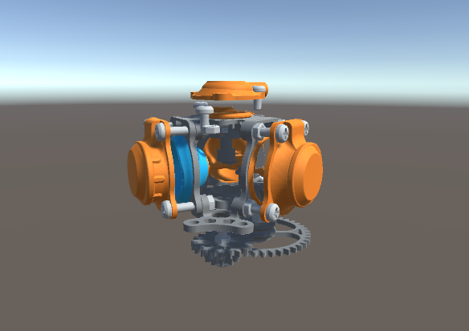
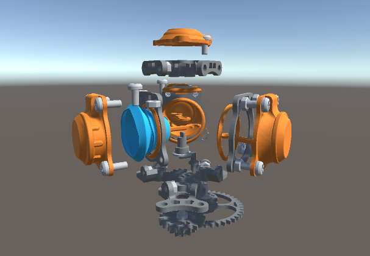
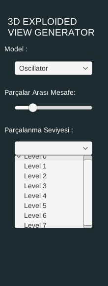
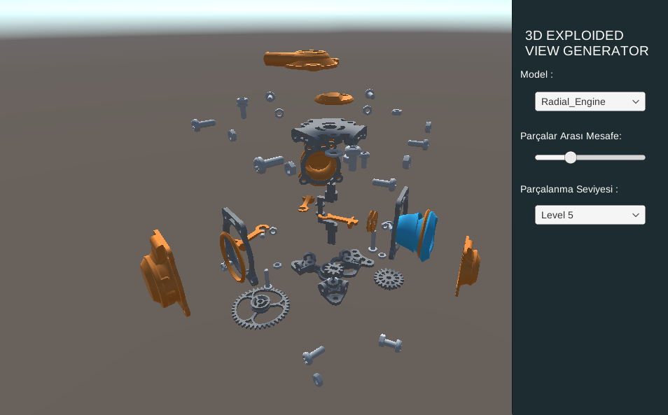
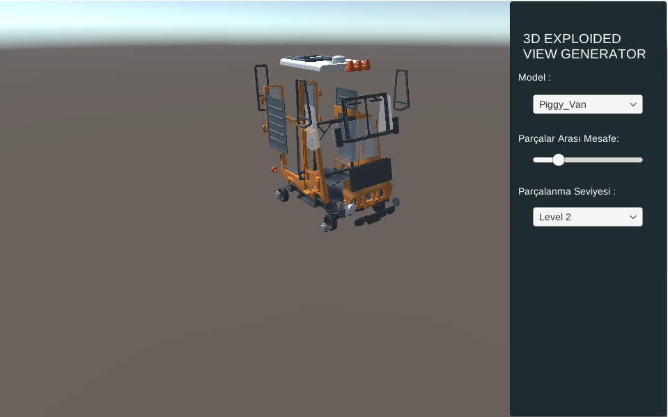

# Multimedya Veritabanı Gösterici Uygulaması

Bu proje, 3D objeleri seviyeye bağlı olarak parçalara ayıran bir uygulamadır. Kendi geliştirdiğim algoritma sayesinde, kullanıcılar seçtikleri 3D modelin parçalanma seviyelerini ve parçaların uzaklaşma mesafesini belirleyebilir. Bu proje, Unity WebGL platformunda çalışacak şekilde derlenmiş ve tarayıcı üzerinden etkileşimli bir deneyim sunmaktadır.

<div style="display: flex; justify-content: center;">
  
  
  <br/><br/>
  <br/><br/>
  <br/><br/>
  
  <br/><br/>
  <br/><br/>
  <br/><br/>
</div>


## İçindekiler
- [Kurulum](#kurulum)
- [Kullanım](#kullanım)
- [Özellikler](#özellikler)
- [Parçalanma Örnekleri](#parçalanma-örnekleri)
- [Geliştirici Notları](#geliştirici-notları)

## Kurulum

### Gereksinimler
- Web tarayıcısı (Chrome, Firefox, Edge, Safari gibi modern tarayıcılar)
- İnternet bağlantısı (proje WebGL formatında sunulmuşsa, internet bağlantısı gereklidir)

### Adımlar
1. Bu projeyi indirin veya GitHub reposunu klonlayın:
   ```bash
   git clone https://github.com/seyitalikoc/Grup30-Multimedya-Veritabani.git

2. Unity Editor kullanarak, projeyi açın.

3. Unity'de projeyi WebGL platformu için derlemek için şu adımları takip edin:
-  File > Build Settings menüsüne gidin.
-  Platform olarak WebGL'i seçin.
- Build butonuna tıklayın.

4. WebGL build dosyalarınızı bir web sunucusunda barındırın veya doğrudan bir tarayıcıda çalıştırın.

## Kullanım



Projeyi tarayıcıda çalıştırdıktan sonra, kullanıcılar şu işlemleri yapabilir:

1. 3D modellerden birini seçin.
2. Parçalanma seviyesini belirleyin. Bu, modelin ne kadar ayrılacağını kontrol eder.
3. Parçaların uzaklaşma mesafesini ayarlayın. Bu, parçaların birbirinden ne kadar uzaklaşacağını belirler.

Bu etkileşimli ayarlarla, modelin parçalanma dinamiklerini görsel olarak inceleyebilir ve seviyelere bağlı olarak nasıl değiştiğini gözlemleyebilirsiniz.

## Özellikler

- **Dinamik Parçalanma**: Kullanıcılar, 3D modelleri seviyelere göre parçalara ayırabilir. Parçalanma seviyeleri algoritma ile belirlenir ve her model için seviye sayısı farklıdır.
- **Parçaların Uzaklaşma Mesafesi**: Parçalanan objelerin birbirinden ne kadar uzaklaşacağını kullanıcı seçebilir.
- **Etkileşimli 3D Görselleştirme**: Tarayıcı üzerinden 3D modelleri etkileşimli olarak görmek mümkün.
- **WebGL Destekli**: Uygulama, modern tarayıcılarda sorunsuz bir şekilde çalışmak için WebGL platformunda derlenmiştir.

<br/><br/>

<br/><br/>

## Parçalanma Örnekleri
<div style="display: flex; justify-content: center;">
  
  
  
</div>
<br/><br/>
<br/><br/>
<br/><br/>
<br/><br/>
<br/><br/>
<br/><br/>
<br/><br/>

## Geliştirici Notları

- Bu proje Unity 2022.3.21f1 sürümüyle geliştirilmiştir.
- 3 boyutlu modeller *".fbx"* formatındadır.
- WebGL platformu için optimizasyonlar yapılmıştır.
- Eğer proje üzerinde geliştirmeler yapmayı planlıyorsanız, Unity'nin WebGL ile ilgili dökümantasyonuna başvurabilirsiniz: [Unity WebGL Documentation](https://docs.unity3d.com/560/Documentation/Manual/webgl.html)
